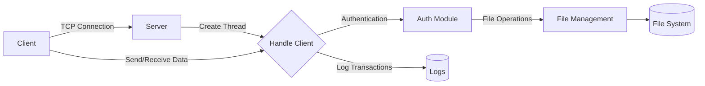
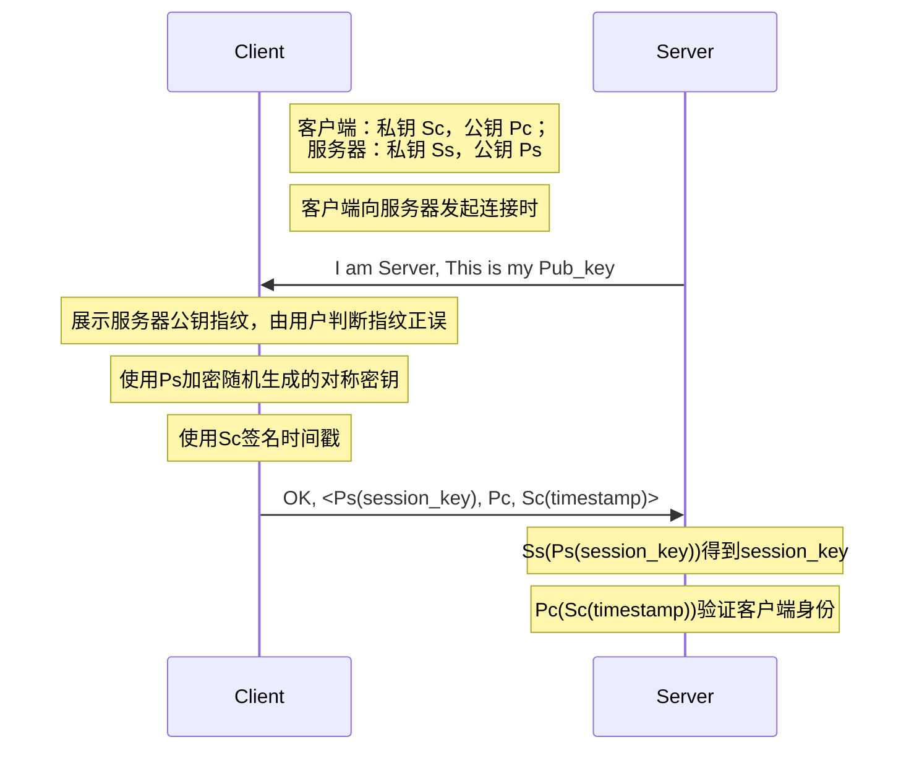

# Secure File Transfer

### 系统目录

```
客户端
│  Client.py                # 客户端主程序脚本，处理用户界面、命令发送与接收等功能
│  util.py                  # 辅助工具脚本，提供加密、解密、文件编码等工具函数
│
├─Client_config             # 存放客户端配置文件，包括用户的加密密钥对
│  ├─55a7663313c7cc8767694b51747351ed0326ea84e3de2bec10f854b332cc2c34  # 用户目录，根据用户公钥哈希命名
│  │      private.pem       # 用户的私钥文件，加密存储，用于身份认证和数据加密
│  │      public.pem        # 用户的公钥文件，公开存储，用于数据解密和验证
│  │
│  └─6025d18fe48abd45168528f18a82e265dd98d421a7084aa09f61b341703901a3  # 另一个用户目录，命名规则同上
│          private.pem      # 另一个用户的私钥文件
│          public.pem       # 另一个用户的公钥文件
│
├─Client_data               # 客户端存储文件数据的目录
   ├─user1                  # 用户1的数据存放目录
   └─user2                  # 用户2的数据存放目录

```

```
服务器
│  Server.py                # 服务器主程序脚本，处理客户端请求、文件管理等功能
│  util.py                  # 辅助工具脚本，提供加密、解密、文件处理等通用功能
│
├─Server_config             # 存放服务器配置文件，包括服务器的公私钥
│      private.pem          # 服务器的私钥文件，用于解密接收到的数据和签名发送数据
│      public.pem           # 服务器的公钥文件，向客户端公开以便客户端加密数据发送
│
├─Server_data               # 服务器存储客户端数据的目录
   ├─149fd1ee590f16ab747023cf4de0a79abe3c171f65f02ceaedbd7b12b2a89c20  # 用户目录，和用户公钥哈希对应
   │      file1.txt         # 在该用户目录下的某文本文件
   │
   └─b11aa734b3dc8c2c49f33ea1fa158ec709a3b6a0d12662335c117db11ca46f3e  # 另一个用户目录
          image1.png         # 在该用户目录下的某图像文件
```

### 功能实现



- [x] 系统架构设计： 设计并实现一个包括客户端和服务器端的系统架构。客户端负责上传和下载文件，服务器端负责接收、存储和发送文件。
- [x] 文件加密： 在文件传输过程中，所有文件必须经过加密处理，请选择合适的加密算法和密钥管理方案。
- [x] 完整性验证： 在文件传输过程中，实现对文件完整性的验证机制。确保接收到的文件与原始文件在传输过程中没有发生篡改。
- [x] 身份认证： 实现客户端和服务器端之间的身份认证机制，确保只有经过授权的用户才能进行文件传输操作。

### 认证模式：



