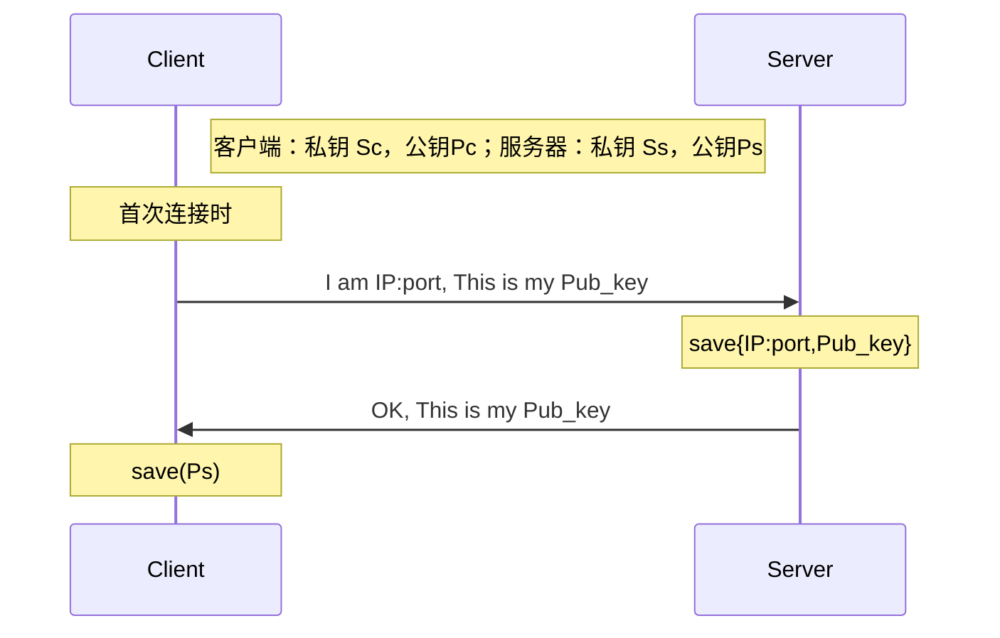
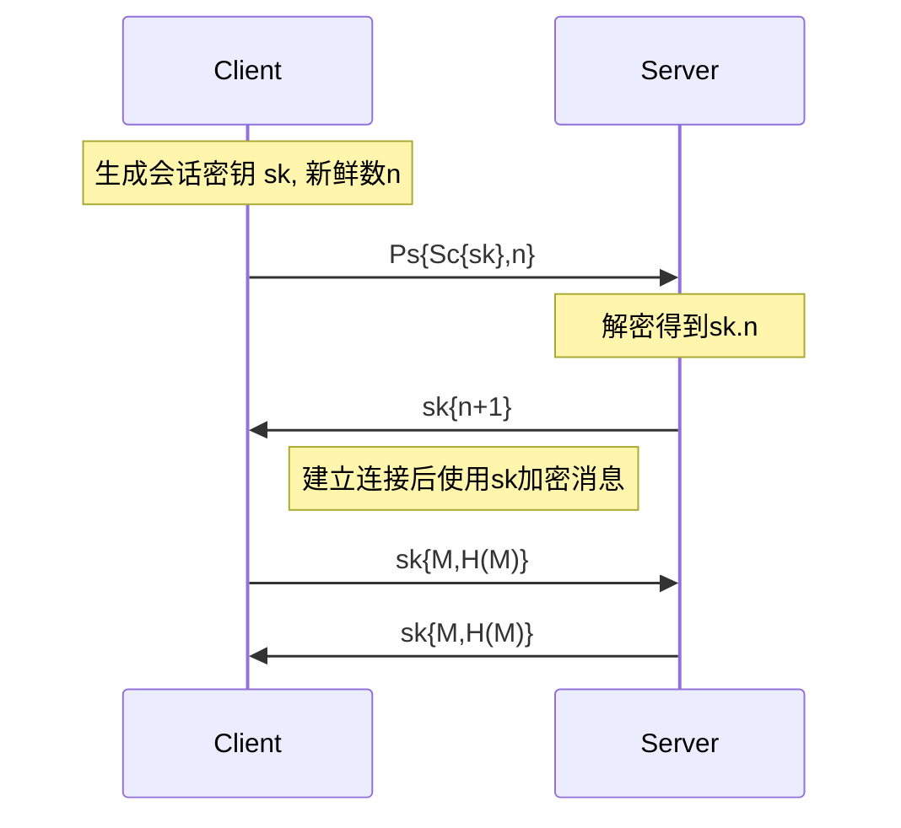

# Secure File Transfer

### 系统框架：

```
Secure File Transfer
│  Client.py        //客户端
│  Server.py        //服务器
│  util.py          //相关工具
│
├─Client_config     //客户端配置文件夹：存放客户端密钥、证书、会话密钥等
├─Client_data       //保存客户端下载数据
├─Server_config     //服务器配置文件夹：存放服务器密钥、证书、会话密钥等
└─Server_data       //服务器数据文件夹
```

### TODO：

- [x] 系统架构设计： 设计并实现一个包括客户端和服务器端的系统架构。客户端负责上传和下载文件，服务器端负责接收、存储和发送文件。
- [ ] 文件加密： 在文件传输过程中，所有文件必须经过加密处理，请选择合适的加密算法和密钥管理方案。
- [ ] 完整性验证： 在文件传输过程中，实现对文件完整性的验证机制。确保接收到的文件与原始文件在传输过程中没有发生篡改。
- [ ] 身份认证： 实现客户端和服务器端之间的身份认证机制，确保只有经过授权的用户才能进行文件传输操作。

### 具体细节（暂定）：

首次连接交换公钥（或者用证书）：



之后进行会话：




### 存在问题

- [x] 没有考虑分包发送，文件大一点就只能收到一部分内容（已解决）

