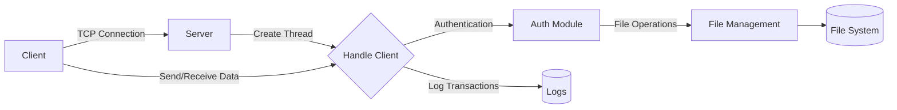
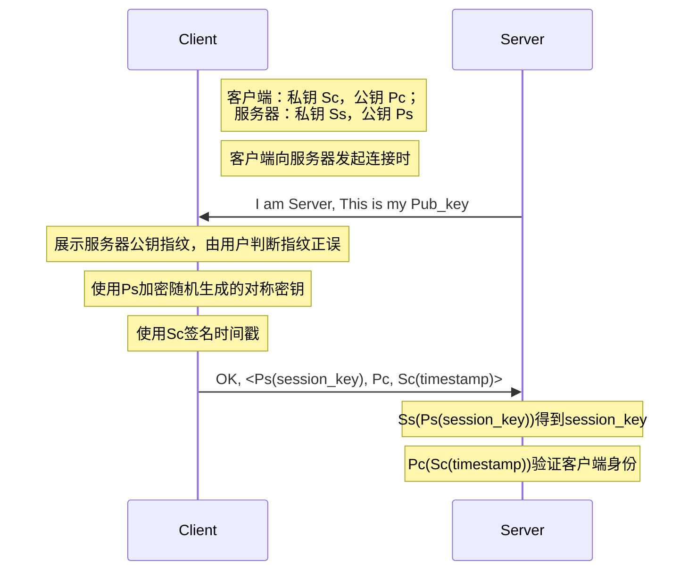

# 安全文件传输

**项目成员**：Bxx Dxx Zxx

## 一、 项目概述

根据项目要求，我们需要设计并实现一个包括客户端和服务器端的系统架构，确保传输过程中文件的完整性和机密性。

首先我们将该任务进行了具体化——将服务器视为一个公共网盘，实现多用户的文件上传和下载。根据作业要求以及项目的实际目标，主要完成了以下的任务：

1. 系统架构搭建：采用一个服务器对应多个用户的模式，实现多个用户同时登录以及文件传输。
2. 用户身份认证：用户在使用系统时需要进行注册和登录，该过程使用公私钥体系作为保证，保证服务器和客户端的相互信任。
3. 文件加密传输：在用户成功登录并完成安全确认后，会生成会话密钥，并通过数字信封的方式进行共享，文件传输使用会话密钥保证传输过程的机密性。另外，我们的文件传输还满足以下两个特性：
   - 通过对传输内容进行编码和加密处理，可以对文字、图片、音频等多种类型文件进行可靠传输。
   - 在文件传输时，每个用户使用自己的服务器文件夹，互相之间实现隔离。
4. 完整性校验：使用HMAC作为完整性校验的技术工具，利用会话密钥对传输前后的消息散列进行加密和验证，确保接收到的文件与原始文件在传输过程中没有发生篡改。

总的来说，通过实现以上功能，我们构建了一套完整的文件安全传输系统，通过利用多种安全措施，极大程度地保证了系统的的实用性和安全性。

## 二、功能说明

### 1、系统架构搭建

系统采用客户端-服务器模式，通过网络套接字实现数据通信，支持多用户并发处理文件操作。该架构的设计允许服务器同时处理多个客户端的请求，每个客户端通过一个独立的线程进行通信，确保了处理的效率和系统资源的合理分配。

#### 1.1、系统目录

```
客户端
│  Client.py                # 客户端主程序脚本，处理用户界面、命令发送与接收等功能
│  util.py                  # 辅助工具脚本，提供加密、解密、文件编码等工具函数
│
├─Client_config             # 存放客户端配置文件，包括用户的加密密钥对
│  ├─55a7663313c7cc8767694b51747351ed0326ea84e3de2bec10f854b332cc2c34  # 用户目录，根据用户公钥哈希命名
│  │      private.pem       # 用户的私钥文件，加密存储，用于身份认证和数据加密
│  │      public.pem        # 用户的公钥文件，公开存储，用于数据解密和验证
│  │
│  └─6025d18fe48abd45168528f18a82e265dd98d421a7084aa09f61b341703901a3  # 另一个用户目录，命名规则同上
│          private.pem      # 另一个用户的私钥文件
│          public.pem       # 另一个用户的公钥文件
│
├─Client_data               # 客户端存储文件数据的目录
   ├─user1                  # 用户1的数据存放目录
   └─user2                  # 用户2的数据存放目录

```

```
服务器
│  Server.py                # 服务器主程序脚本，处理客户端请求、文件管理等功能
│  util.py                  # 辅助工具脚本，提供加密、解密、文件处理等通用功能
│
├─Server_config             # 存放服务器配置文件，包括服务器的公私钥
│      private.pem          # 服务器的私钥文件，用于解密接收到的数据和签名发送数据
│      public.pem           # 服务器的公钥文件，向客户端公开以便客户端加密数据发送
│
├─Server_data               # 服务器存储客户端数据的目录
   ├─149fd1ee590f16ab747023cf4de0a79abe3c171f65f02ceaedbd7b12b2a89c20  # 用户目录，和用户公钥哈希对应
   │      file1.txt         # 在该用户目录下的某文本文件
   │
   └─b11aa734b3dc8c2c49f33ea1fa158ec709a3b6a0d12662335c117db11ca46f3e  # 另一个用户目录
          image1.png         # 在该用户目录下的某图像文件
```

#### 1.2、功能说明



上图描述了我们设计的系统客户端与服务器之间的整体交互流程，包括从建立连接到数据传输和日志记录的关键步骤。下面将对主要部分及功能实现进行详细解释：

- **多线程处理**：在服务器端，为每个新的客户端连接创建一个独立的处理线程。这样可以并行处理多个客户端的请求，提高了系统的响应速度和并发处理能力。线程的创建是通过Python的`threading.Thread`实现的，每个线程分别处理一个客户端的所有请求，直至会话结束。

  ```py
  thread = threading.Thread(target=self.handle_client, args=(conn, addr))
  thread.start()
  ```

- **Socket通信**：客户端和服务器端均使用TCP/IP协议的套接字进行通信。服务器监听一个固定的IP地址和端口，等待客户端的连接请求。当客户端发起连接时，服务器接受连接并为其创建一个新线程来处理后续的数据交换。

  ```py
  self.server = socket.socket(socket.AF_INET, socket.SOCK_STREAM)
  self.server.bind(self.ADDR)
  self.server.listen()
  ```

- **数据发送/接收**：

  - **双向数据传输**：客户端和服务器之间的数据交互包括命令发送、文件数据传输等。数据在传输前会进行加密，接收方解密后进行相应操作。
  - **加密通信**：使用会话密钥对传输数据进行对称加密，确保数据在网络中的安全。
  - **多类型文件传输**：为了实现这一功能，文件在上传和下载时被读取为二进制数据，然后进行编码和加密处理。这种处理方式不依赖于文件类型，因此可以适用于文本文件、图片、音频、视频等任何类型的文件。

  ```python
  with open(filepath, "rb") as f:
      file_contents = f.read()
  b64_filename = b64_encode_text(filename).decode(self.FORMAT
  b64_contents = b64_encode_file(file_contents).decode(self.FORMAT)
  b64_contents = encrypt_text(b64_contents, session_key.encode()).decode(
      "utf-8"
  
  b64_hash = calculate_hash(b64_contents, session_key.encode(), self.FORMAT
  send_data = "FILE@"
  send_data += f"{b64_filename}@{b64_contents}@{b64_hash}$"
  conn.send(b64_encode_text(send_data))
  ```

- **资源和目录管理**：

  - **文件操作处理**：认证通过后，客户端可以进行文件操作，包括了上传、下载、删除和列出文件。服务器根据客户端请求的操作类型，调用相应的处理函数来执行操作。

  - **独立的文件目录**：服务器为每个用户维护一个独立的文件存储目录，在`Server_data`下根据用户公钥的哈希值创建子目录，从而实现数据的隔离和管理。客户端则在本地维护`Client_data`和`Client_config`目录，分别用于存储用户文件和配置信息（用户的密钥对）

  ```python
  data = b64_decode_text(conn.recv(self.SIZE))
  if not data:
      break
  data = data.split("@")
  cmd = data[0]
  if cmd == "LIST":
      self.handle_list(conn, client_directory)
  elif cmd == "UPLOAD":
      self.handle_upload(conn, data, session_key, client_directory)
  elif cmd == "DOWNLOAD":
      self.handle_download(conn, data, session_key, client_directory)
  elif cmd == "DELETE":
      self.handle_delete(conn, data, client_directory)
  elif cmd == "LOGOUT":
      self.handle_logout(conn)
      break
  elif cmd == "HELP":
      self.handle_help(conn)
  ```

- **日志记录（Logs）**：服务器会记录所有的交易日志，包括每个客户端的连接信息、操作行为和可能的异常。这对于系统的监控、审计和故障排查非常重要。

  ```python
  # 对于重要信息都采用了如下方式进行记录
  logging.info("File uploaded successfully by client %s", addr)
  ```

- **安全性设计**：通过使用RSA加密公私钥对，实现密钥的安全交换和数据传输的加密和完整性校验，确保了数据传输过程中的安全性和数据的隐私性，详细内容会在后面进一步展开说明。

### 2、用户身份认证

实现客户端和服务器端之间的身份认证机制，确保只有经过授权的用户才能进行文件传输操作。

#### 2.1、功能说明



【服务器身份验证】：接收服务器公钥，由客户验证服务器公钥指纹。

```bash
客户端：
[SERVER]: Welcome to the File Server.
[SERVER]: The server public key fingerprint is: 5eef126e66ff39dd47736f475abe64a63aeced68738bac95337ae214543de438
[SERVER]: Please confirm whether the server fingerprint is correct. If it is correct, press YES. Otherwise, press NO.
> YES
[SERVER]: Identity authentication passed, please continue
```

【客户端身份验证】：客户端通过密码证明对本地某个公私钥对的所有。

私钥采用`Password`加密，公私钥对存储在`Client_config\hash(Username)`下。

```bash
客户端：
[CLIENT]: Please enter your username and password to login.
[CLIENT]: If the username does not exist, a new account will be created for you.
[Username]: daichuan
[Password]: 123456
[CLIENT]: User daichuan already exists.
[CLIENT]: The password is correct, please continue.
```

用户登录成功后（说明公私钥对属于该用户），使用私钥签名`timestamp`。然后将公钥、私钥签名的`timestamp`一起发给服务器。服务器验证公私钥匹配，公钥位于白名单中。则允许会话继续进行。

```
服务器端：
[SESSION KEY] JcEnw8UxiVMlF_1_YLZxN7DJ-p5tMqn80d8xL_G3aTw=
[SIGNATURE] valid.
[AUTHENTICATION] True
```

#### 2.2、代码说明

##### 客户端身份验证流程

1. **登录与公私钥验证**：客户端启动时会提示用户输入用户名和密码，这是验证用户身份的第一步。如果是新用户，则为其生成新的RSA公私钥对，并用密码加密私钥存储在本地。如果是现有用户，系统将验证输入的密码是否正确。

```python
username = input("[Username]: ")
password = input("[Password]: ")
hash_name = hash_str(username)
hash_password = hash_str(password)
user_path = "Client_config" + "/" + hash_name

if not os.path.exists(user_path):
    os.makedirs(user_path)
    print("[CLIENT]: User does not exist, register for you.")
    generate_rsa_key_pair_with_password(user_path, hash_password)
else:
    if verify_rsa_private_key_with_password(user_path, hash_password):
        print("[CLIENT]: The password is correct, please continue.")
    else:
        print("[CLIENT]: The password is incorrect.")
```

2. **签名时间戳**：登录成功后，客户端使用私钥对一个时间戳进行签名，这个签名将用来验证客户端的身份。

```python
timestamp = int(datetime.utcnow().timestamp() // 600)
message_with_timestamp = str(timestamp)
signature = sign_message_with_private_key(private_key, message_with_timestamp)
```

3. **发送签名和公钥**：客户端将签名的时间戳和公钥发送给服务器，服务器将使用这些信息来验证客户端的身份。

```python
public_key_data = getCASendData(os.path.join(user_path, "public.pem"))
client_directory = os.path.join("Client_data", username)
return client_directory, f"{signature}@{public_key_data}"
```

##### 服务器身份验证流程

1. **发送服务器公钥**：当客户端连接到服务器时，服务器首先发送其公钥给客户端。

```python
send_data = "OK@Welcome to the File Server.@" + getCASendData(self.SERVER_PUBLIC)
conn.send(b64_encode_text(send_data))
```

2. **处理客户端响应**：客户端接收到服务器公钥后，可以选择验证公钥的指纹是否正确。如果客户端接受公钥（通过发送“YES”响应），则继续会话；否则（发送“NO”响应），断开连接。

```python
data = b64_decode_text(conn.recv(self.SIZE))
cmd = data[0]
if cmd == "NO":
    self.handle_no(conn)
elif cmd == "YES":
    # 解密会话密钥和验证签名等操作
```

3. **验证客户端签名**：服务器将使用客户端提供的公钥验证签名的时间戳，确保它是由匹配的私钥签名的。

```python
signature_valid = verify_signature(client_public_key, message_with_timestamp, signature)
if signature_valid:
    print("[SIGNATURE] valid.")
    self.handle_yes(conn)
else:
    print("[SIGNATURE] invalid.")
    self.handle_no(conn)
```

这一过程确保了双方身份的正确验证，只有经过正确验证的客户端才能进行文件操作，有效地保障了系统的安全性。通过这样的设计，系统可以防止未授权的访问，同时确保通信双方的身份真实性。

### 3、文件加密传输

#### 3.1、功能说明

**密钥管理方案**：采用数字信封的方式，由客户端生成当前会话使用的对称密钥，使用服务器公钥加密后发送给服务器端。密钥管理通过传递参数的方式，实现了会话隔离。

**加密算法**：`Fernet` 是一个对称加密系统，它使用了以下加密算法和技术来加密和解密数据：

1. **AES (Advanced Encryption Standard)**: 使用 128 位的 AES 算法在 CBC（Cipher Block Chaining）模式下加密数据。
2. **HMAC (Hash-based Message Authentication Code)**: 使用 SHA256 散列函数来验证消息的完整性和真实性。
3. **PKCS7 Padding**: 用于填充数据，使其适应 AES 的块大小要求。

#### 3.2、代码说明

```python
def encrypt_text(text, key):
    """Given a text (str) and key (bytes), it encrypts the text and return it"""
    fer = Fernet(key)
    return fer.encrypt(text.encode("utf-8"))


def decrypt_text(text, key):
    """Given a text (str) and key (bytes), it decrypts the text and return it"""
    fer = Fernet(key)
    return fer.decrypt(text).decode("utf-8")
```

### 4、完整性校验

在文件传输过程中，实现对文件完整性的验证机制。确保接收到的文件与原始文件在传输过程中没有发生篡改。

#### 4.1、功能说明

本项目使用HMAC作为完整性校验的技术工具。HMAC（Hash-based Message Authentication Code）是一种基于哈希函数的消息认证码技术，其提供了一种通过共享密钥在消息发送方和接收方之间进行消息认证的方法。与直接进行哈希相比，HMAC更加安全，其在计算消息认证码时使用了通信双方所选择的秘钥，即使攻击者知道了哈希函数的实现原理，也很难伪造出正确的消息认证码，从而提高了安全性。

本项目主要在上传（UPLOAD）和下载（DOWNLOAD）文件时需要进行完整性校验，以确保文件内容没有遭到篡改。上传和下载的文件传输过程本质上是对称的，下载也可以看做另一种形式上传，因此我们以上传过程为例，介绍完整性校验的过程：

- 客户端先对文件内容进行base64编码和加密，随后使用HMAC对文件内容计算哈希值，将base64编码之后的哈希值添加到原本的消息之后，一起发送给服务器

```python
b64_filename = b64_encode_text(filename).decode(self.FORMAT)

b64_contents = b64_encode_file(file_contents).decode(self.FORMAT)
b64_contents = encrypt_text(b64_contents, self.session_key.encode()).decode(self.FORMAT)

# 计算HMAC
b64_hash = calculate_hash(b64_contents, self.session_key.encode(), self.FORMAT)

# 附在原始消息之后发送
data = f"UPLOAD@{b64_filename}@{b64_contents}@{b64_hash}$"
self.send_command(data)
```

- 服务器端在收到消息之后，首先将其切分为加密消息本体和哈希值，随后使用密钥和消息本体重新计算HMAC，与消息中附带的哈希值进行比较：如果两者一致，则验证通过，进行后续的解密和解码环节；如果验证不通过，则直接终止，并向客户端反馈错误信息

```python
# 接收完整的消息内容
while not file_contents.endswith("$"):
  file_contents += b64_decode_text(conn.recv(self.SIZE))

# 分别提取消息本身和哈希值 
file_contents = file_contents[:-1]
split_hash = file_contents.split("@")
file_contents = split_hash[0]
file_hash_expected = split_hash[1]

# 通过完整性校验，再进行解密和base64解码
if verify_file_integrity(file_contents, file_hash_expected, self.session_key.encode(), self.FORMAT):
  file_contents = decrypt_text(file_contents.encode(self.FORMAT), self.session_key.encode())
  file_contents = b64_decode_file(file_contents.encode("utf-8"))

else:
  send_data = "ERROR@File integrity check failed."
  conn.send(b64_encode_text(send_data))
```

#### 4.2、代码说明

```python
def calculate_hash(contents, key, format="utf-8", algorithm=hashes.SHA256()):
    # HAMC 计算文件哈希，并进行base64编码
    hasher = hmac.HMAC(key, algorithm)
    hasher.update(contents.encode(format))
    b64_hash = b64_encode_text(hasher.finalize().hex())
    return b64_hash.decode(format)


def verify_file_integrity(contents, expected_hash, key, format="utf-8"):
    # 重新计算哈希，进行完整性检验
    b64_hash = calculate_hash(contents, key, format)
    return b64_hash == expected_hash
```

- 完整性校验部分的核心代码如上
  - 在计算哈希时，我们使用通信双方的会话密钥作为HMAC的密钥，计算文件内容的哈希值，并进行base64编码，以便进行网络传输。
  - 接收方同时获得文件内容和哈希值，使用相同的密钥和收到的消息内容重新计算MAC，与原始消息中附带的MAC进行比较，以判断消息是否遭到篡改
- 由于使用了HMAC技术，只有拥有会话密钥的通信双方才能生成正确的MAC。攻击者即使篡改了消息，也无法计算得出合法的MAC值，因此成功阻止了攻击者同时替换消息内容和哈希值。
- 在本项目中，我们在传输文件前先进行加密，再对加密内容生成HMAC。与之对应，接收方先验证消息的完整性，如果验证通过，再进行解密；如果验证不通过，则无效浪费计算资源进行解密运算。

## 三、项目演示

用户user1（初次登录并上传和下载文件`file1.txt`）：

```
❯❯ python .\Client.py
[CLIENT]: Welcome to the File Transfer System!
[CLIENT]: Please enter your username and password to login.
[CLIENT]: If the username does not exist, a new account will be created for you.
[Username]: user1
[Password]: 123456
[CLIENT]: User does not exist, register for you.
[CLIENT]: The message to be signed is: 2864246
[SERVER]: Welcome to the File Server.
[SERVER]: The server public key fingerprint is: f501ddc8e1a49b5bd1808587833fdeaa506771f94bf42157b0a5920c08d67c5c
[SERVER]: Please confirm whether the server fingerprint is correct. If it is correct, press YES. Otherwise, press NO.
> YES
[SERVER]: Identity authentication passed, please continue
> LIST
The server directory is empty
> UPLOAD C:\Users\kody\Desktop\file1.txt
File uploaded successfully.
> LIST  
file1.txt
> DOWNLOAD file1.txt
> File 'file1.txt' downloaded successfully.
LOGOUT
[SERVER]: Goodbye!
send_commands: Disconnected from the server.
receive_messages: Disconnected from the server.
```

用户user2（初次登录并上传文件image1.png，file2.txt，然后删除了file2.txt）：

```
❯❯ python .\Client.py
[CLIENT]: Welcome to the File Transfer System!
[CLIENT]: Please enter your username and password to login.
[CLIENT]: If the username does not exist, a new account will be created for you.
[Username]: user2
[Password]: 123456
[CLIENT]: User does not exist, register for you.
[CLIENT]: The message to be signed is: 2864247
[SERVER]: Welcome to the File Server.
[SERVER]: The server public key fingerprint is: f501ddc8e1a49b5bd1808587833fdeaa506771f94bf42157b0a5920c08d67c5c
[SERVER]: Please confirm whether the server fingerprint is correct. If it is correct, press YES. Otherwise, press NO.
> YES
[SERVER]: Identity authentication passed, please continue
> LIST
The server directory is empty
> HELP
LIST: List all the files from the server.
UPLOAD <path>: Upload a file to the server.
DOWNLOAD <filename>: Download a file from the server.
DELETE <filename>: Delete a file from the server.
LOGOUT: Disconnect from the server.
HELP: List all the commands.
> UPLOAD C:\Users\kody\Desktop\image1.png
File uploaded successfully.
> LIST
image1.png
> UPLOAD C:\Users\kody\Desktop\file2.txt 
File uploaded successfully.
> LIST
file2.txt
image1.png
> DELETE file2.txt
File deleted successfully.
> LIST
image1.png
> LOGOUT
[SERVER]: Goodbye!
receive_messages: Disconnected from the server.
send_commands: Disconnected from the server.
```

用户user1（再次登录，首次密码输入错误，再次尝试成功登录后下载文件file1.txt）

```
❯❯ python .\Client.py
[CLIENT]: Welcome to the File Transfer System!
[CLIENT]: Please enter your username and password to login.
[CLIENT]: If the username does not exist, a new account will be created for you.
[Username]: user1
[Password]: 546789
[CLIENT]: User user1 already exists.
Failed to decrypt the private key: Bad decrypt. Incorrect password?
[CLIENT]: The password is incorrect.
[CLIENT]: To exit, please enter [exit]. To continue, please enter any character:
[Username]: user1
[Password]: 123456
[CLIENT]: User user1 already exists.
[CLIENT]: The password is correct, please continue.
[CLIENT]: The message to be signed is: 2864247
[SERVER]: Welcome to the File Server.
[SERVER]: The server public key fingerprint is: f501ddc8e1a49b5bd1808587833fdeaa506771f94bf42157b0a5920c08d67c5c
[SERVER]: Please confirm whether the server fingerprint is correct. If it is correct, press YES. Otherwise, press NO.
> YES
[SERVER]: Identity authentication passed, please continue
> LIST
file1.txt
> DOWNLOAD file1.txt
> File 'file1.txt' downloaded successfully.
LOGOUT
[SERVER]: Goodbye!
send_commands: Disconnected from the server.
receive_messages: Disconnected from the server.
```

服务器信息如下：

```
❯❯ python .\Server.py
RSA keys not found. Generating new keys...
[STARTING] Server is starting.
[LISTENING] Server is listening on 127.0.0.1:2333.
[NEW CONNECTION] ('127.0.0.1', 14814) connected.
[ACTIVE CONNECTIONS] 1
[SESSION KEY] QbKKtL1XBXYmcX2YvLWvaJJs9c20Rw8wvi8qYxY5R7E=
[SIGNATURE] valid.
[AUTHENTICATION] True
[SERVER]: session key exchange successfully!
[UPLOAD]  file1.txt
[UPLOAD] successfullyile uploaded successfully
[NEW CONNECTION] ('127.0.0.1', 14879) connected.
[ACTIVE CONNECTIONS] 2
[SESSION KEY] RqxZ-f8eqF9QZXs3oqpYXShsA5aAqkTkrtEvGE8cPuc=
[SIGNATURE] valid.
[AUTHENTICATION] True
[SERVER]: session key exchange successfully!
[UPLOAD]  image1.png
[UPLOAD] successfullyile uploaded successfully
[UPLOAD]  file2.txt
[UPLOAD] successfullyile uploaded successfully
[DELETE] File deleted successfully
[DISCONNECTED] ('127.0.0.1', 14879) disconnected
[ACTIVE CONNECTIONS] 1
[NEW CONNECTION] ('127.0.0.1', 14892) connected.
[ACTIVE CONNECTIONS] 2
[SESSION KEY] 45cZaVLXlg0tIcZ7iciCLWVVkPm22hrOIz-W_--tt_k=
[SIGNATURE] valid.
[AUTHENTICATION] True
[SERVER]: session key exchange successfully!
[DISCONNECTED] ('127.0.0.1', 14892) disconnected
[ACTIVE CONNECTIONS] 1
[DOWNLOAD]  file1.txt
[DOWNLOAD] finished
[DISCONNECTED] ('127.0.0.1', 14814) disconnected
[ACTIVE CONNECTIONS] 0
[NEW CONNECTION] ('127.0.0.1', 14908) connected.
[ACTIVE CONNECTIONS] 1
[SESSION KEY] umvveRaoFZKJfDRxYFalV7coW_Zov-EACB7JtVKfeWY=
[SIGNATURE] valid.
[AUTHENTICATION] True
[SERVER]: session key exchange successfully!
[DOWNLOAD]  file1.txt
[DOWNLOAD] finished
[DISCONNECTED] ('127.0.0.1', 14908) disconnected
[ACTIVE CONNECTIONS] 0
```

## 三、项目总结

在本次项目中，我们还是遇到了不少的困难。首先，多线程的使用确实提高了系统的并发能力，但同时也引入了数据同步和线程安全的问题。例如，确保客户端的命令处理和服务器响应在并发环境中正确无误，我们通过Python的`threading.Condition`来管理线程之间的协调，使得每个线程可以在适当的时候安全地访问共享资源，防止了数据冲突和资源竞争。

文件传输的完整性也是遇到的一个突出的困难。在文件较大或网络不稳定的情况下，文件传输有可能不完整，而且一开始的系统只能传输比较短的文字内容。为了解决这个问题，我们重构了传输文件的逻辑，使用`sendall`并增加的有效的定位符确保接收的完整性，结合作业要求的文件完整性校验机制，通过计算文件的哈希值并在文件传输完成后对比哈希值，进一步确保了文件的完整性和正确性。

此外，在加密机制的实施方法上，我们也调整了多种策略，最后决定使用RSA加密算法来安全地交换密钥，然后使用AES算法来加密实际的文件数据。实现这一机制的过程中，我们需要确保密钥的安全生成和存储，以及加解密过程的高效执行。通过调整加密库的使用方式和优化数据处理流程，我们最终实现了一个既安全又高效的加密传输系统。

在项目的开发和测试阶段，我们深刻体会到了编写清晰、可维护代码的重要性。在多人协作的环境中，代码的可读性和一致性直接影响团队的工作效率。我们利用git统一管理，每个人负责一部分内容最后整合和优化，确保代码质量和系统稳定性。这些实践不仅提高了我们的开发效率，也让团队成员在项目中获得了宝贵的经验，学习到了现代软件工程的最佳实践。

总的来说，这个项目不仅解决了实际的技术问题，也加深了我们对网络编程、加密通信和多线程处理等领域的理解。通过面对和解决实际问题，我们提升了解决复杂问题的能力，获得了宝贵的实战经验，这将为未来类似项目的开发奠定坚实的基础。
